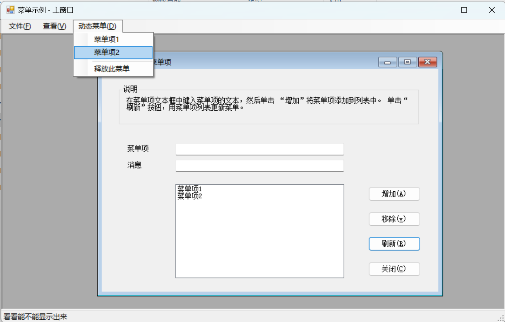

# XSharp_DynamicMenus
[简体中文](README.md) | [English](README_En.md)

## Instructions
20 years ago, MS released [.NET Samples for Visual FoxPro Developers](https://www.microsoft.com/en-eg/download/details.aspx?id=17602&msockid=0bcd37265329654913db23835207643f). it was written in the VB.NET language.
About ten years ago, [X# (XSharp)](https://www.xsharp.eu/) was released. After nearly a decade of development, it has become more and more compatible with the VFP syntax. This provides a shortcut for VFP developers to cross over into the .NET world.

This repository is an attempt to rewrite one of the [.NET Samples for Visual FoxPro Developers](https://www.microsoft.com/en-eg/download/details.aspx?id=17602&msockid=0bcd37265329654913db23835207643f) in a 1:1 fashion using X# (VFP dialect): dynamic menus.

## Development Environments：
1. [VS IDE 2022 Community](https://visualstudio.microsoft.com/vs/)
2. [X#](https://xsharp.eu/) Ver:2.20.0.3
3. .NET Framework 4.8